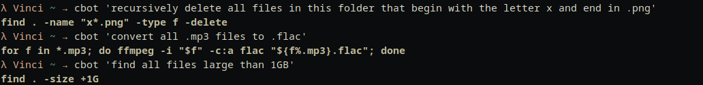
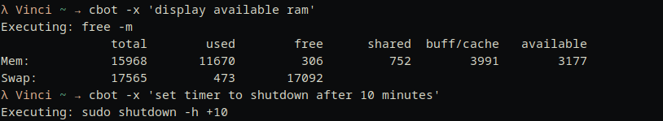

# Completion Bot

Simplified adaption from [graiz's cbot](https://github.com/graiz/cbot). 

Type plain English to cbot and he will will output the CLI command as a string, or execute the command if you add the -x modifier.

### Outputting string

### Execution 

## Instalation

1. pip3 install openai
2. Add API as environment variable "OPENAI_API_KEY" or paste plain text in code.
3. chmod +x cbot
4. Add to existing $PATH bin, or add new location to $PATH by add the following to your .bashrc or .zshrc
export PATH=/home/usr/cbot_directory_location:$PATH

Enjoy ;)