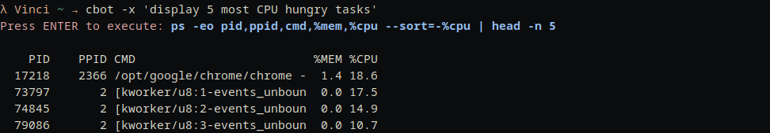

# CLI Completion Bot

Inspired and adapted from [graiz's cbot](https://github.com/graiz/cbot).

Type plain English into cbot and it will output the CLI command as a string, execute the command, or copy it to clipboard. 

## Output command as string

## Execute command

## Copy command

## Instalation

1. pip3 install openai
2. Add API as environment variable "OPENAI_API_KEY" or paste plain text in code.
3. chmod +x cbot
4. Add to existing $PATH bin, or add new location to $PATH by add the following to your .bashrc or .zshrc
export PATH=/home/usr/cbot_directory_location:$PATH

Enjoy ;)